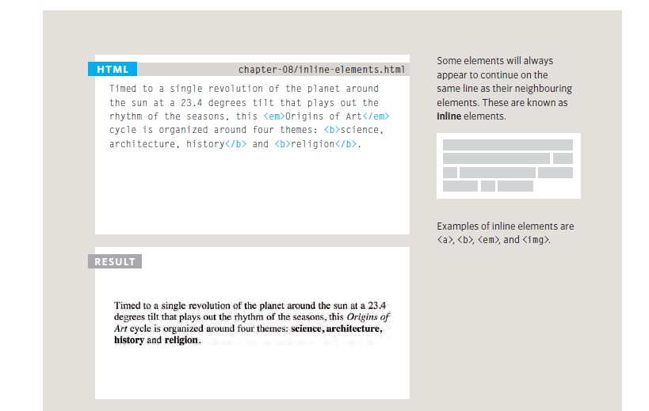
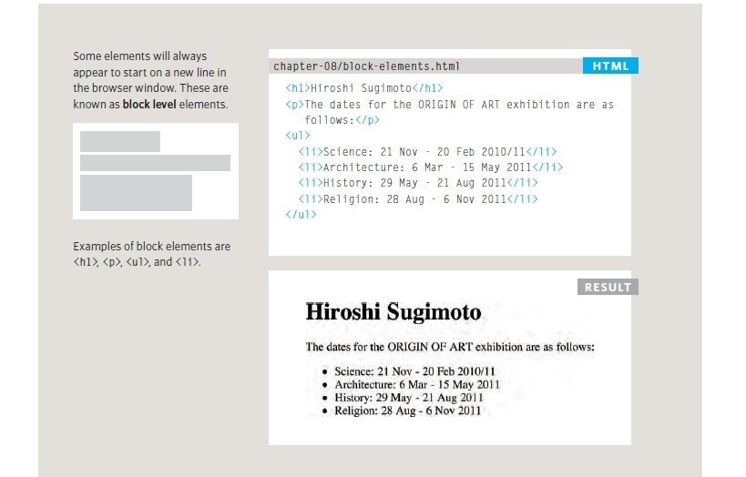

# Read03

## Extra Markup
*Since the web was first created, there have been several different versions of HTML. (HTML4, XHTML1.0, HTML5)*

### Doc Type:
Because there have been several versions of HTML, each web page should begin with a DOCTYPE declaration to tell a browser which version of HTML the page is using (although browsers usually display the page even if it is not included). We will therefore be including one in each example for the rest of the book.

###  Comments ON HTML:
  !-- --
  
If you want to add a comment to your code that will not be visible in the user's browser, you can add the text between these characters.

### ID Attribute:
Every HTML element can carry the id attribute. It is used to uniquely identify that element from other elements on the page. Its value should start with a letter
or an underscore (not a number or any other character). It is important that no two elements on the same page have the same value for their id
attributes (otherwise the value is no longer unique).

### Class Attribute:
Every HTML element can also carry a class attribute. Sometimes, rather than uniquely identifying one element within a document, you will want a way to identify 
several elementsn as being different from the other elements on the page. For example, you might have some paragraphs of text that contain information that is more
important than others and want to distinguish these elements, or you might want to differentiate between links that point to other pages on your own site and links
that point to external sites.

### Blocks Elements:

### Inline Elements:

